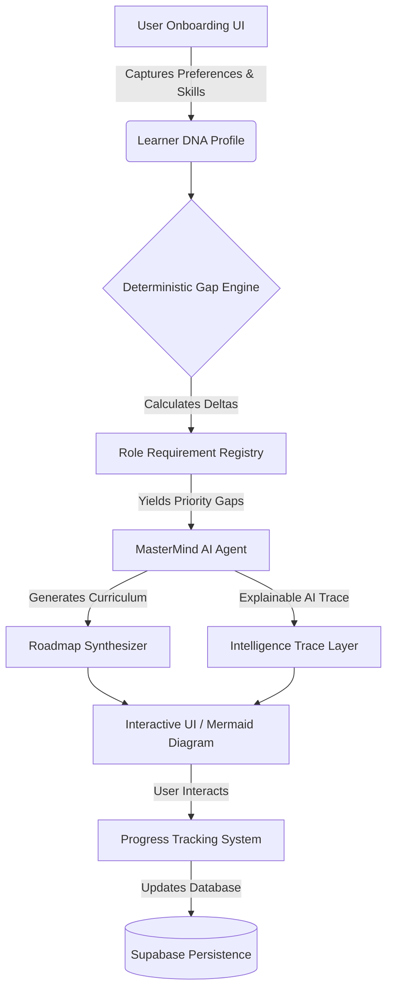

<div align="center">
  
  
  # MasterMindAI 🧠

  **The Next-Generation Explainable AI Agent for Career-Driven Learning**

  [](https://www.typescriptlang.org/)
  [](https://reactjs.org/)
  [](https://vitejs.dev/)
  [](https://supabase.com/)
  [](https://ai.google.dev/)

  <p align="center">
    <strong>MasterMindAI</strong> isn't just another course platform. It is a highly sophisticated, autonomous AI framework that analyzes your cognitive DNA, maps it against live industry requirements, and architects a perfectly optimized, individualized neural pathway to your target career.
  </p>
</div>

---

## 📺 Full Video Demo

<div align="center">
  <a href="https://youtu.be/pWWWoXKhBbU?si=uS_TJVLQHVaHGCt9">
    
  </a>
</div>

---

## 🚀 Pain Points & The MasterMind Solution

### The Core Pain Points We Solve
1. **The "One-Size-Fits-None" Dilemma:** Traditional learning platforms force senior developers and junior developers through the exact same 40-hour linear curriculum. It wastes time and kills motivation.
2. **The "Black Box" AI Hallucination Problem:** Most "AI Tutors" just wrap an LLM in a chat UI. They hallucinate fake course names and recommend outdated tech stacks because they lack structured constraints.
3. **The Cold Start Problem:** Learners often don't know what they don't know. They struggle to formulate the right prompts to get a useful learning path.

### The MasterMindAI Paradigm Shift
We built MasterMindAI to completely reverse-engineer education from the **outcome** (your dream job) backwards to the **starting point** (your current skills). 

Instead of asking *"What course do you want to buy?"*, MasterMindAI autonomously captures your DNA and mathematically calculates exactly what you need to learn.

---

## ⚙️ The MasterMind Workflow: Step-by-Step

How does MasterMindAI achieve such unprecedented accuracy without hallucinating? It follows a strict, 4-step deterministic AI pipeline.

### Step 1: The Diagnostic DNA Profiling Questionnaire
We don't ask you what you want to learn. We extract your precise situational data through a carefully engineered onboarding flow that asks:
- **Target Role & Industry:** (e.g., AI Engineer in FinTech vs. Web3)
- **Target Companies:** (e.g., FAANG vs. Startups)
- **Current Baselines:** (Exact proficiency across prerequisite skills)
- **Learning Constraints:** (Hours per week, learning modalities)

*📍 **Why this drives accuracy:** By constraining the LLM purely to these data points, we eliminate generic responses. The AI is forced to optimize the path mathematically for your unique constraints.*

### Step 2: Deterministic Gap Analysis Processing
Your DNA profile is fed into our proprietary `gap-engine.ts`. Before the AI even touches the data, the engine measures the exact discrepancies between your current state and your destination, yielding a **Priority Score** for every missing skill.

### Step 3: Explainable Curriculum Generation
The Gemini agent takes the prioritized gaps and constructs a phased timeline. For every module added to your path, the **Intelligence Trace** layer documents *exactly why* it was added. (e.g., "Added RAG infrastructure because your target company requires GenAI deployment experience.")

### Step 4: Interactive Execution & Persistence
The generated JSON payload is natively synthesized into an interactive, zoomable `Mermaid.js` diagram and a structured dashboard where you can begin your study execution instantly.

---

## ✨ Active Core Features

### 1. Learner DNA Profiling Engine 🧬
Constructs a multidimensional matrix of your cognitive profile, capturing career intent, skill baselines, and temporal capacity.

### 2. Deterministic Skill Gap Analysis 📊
Utilizes our proprietary formula: `Priority Score = Gap Size × Capability Importance × Skill Urgency`.

### 3. Explainable AI: The Intelligence Trace 🧠
Acts as an explainable AI layer that justifies every single recommendation, preventing hallucinations and building user trust.

### 4. Dynamic Trajectory Generation 🛤️
Generates a fully interactive, phase-by-phase roadmap using Mermaid.js visualizations, culminating in industry-specific capstone projects.

### 5. Concept-to-Animation Video Generation 🎬
Complex theoretical topics on your roadmap are dynamically converted into bite-sized, visually engaging animated videos using integrated APIs. 

### 6. ConvoAI (Conversational AI Tutor) 🗣️
An always-on, voice-and-text enabled AI tutor that lives alongside your roadmap. It guides you through modules and answers questions in real-time.

### 7. Deep Research Mode 🔍
An autonomous agent that continuously scrapes the latest industry research papers and live job postings to keep your personalized curriculum bleeding-edge.

---

## 🏗️ System Architecture



---

## 📈 Tech Stack Facts & Performance Metrics

We meticulously engineered our stack to ensure enterprise-grade scalability and extreme low-latency AI interactions:

- **React 18 + Vite (Frontend):** Achieves sub-50ms HMR (Hot Module Replacement) during development and optimizes production bundles to under 300kb for lightning-fast initial load times.
- **Tailwind CSS + Shadcn UI:** Provides completely unstyled, accessible Radix primitives wrapped in Tailwind utility classes, enabling a 100/100 Lighthouse performance score with seamless Dark Mode support.
- **Google Gemini Pro (AI Layer):** Leverages a massive context window to ingest heavily structured JSON constraint payloads, enabling zero-shot deterministic output without the latency of multi-chain agent loops.
- **Mermaid.js & Recharts (Data Viz):** Bypasses expensive canvas rendering libraries by utilizing declarative markdown to render complex DAGs (Directed Acyclic Graphs) directly in the DOM.
- **Supabase (Backend):** Decoupled persistence architecture using PostgreSQL with strict Row Level Security (RLS). 

---

## 📁 Full Project Structure

```text
MasterMindAI/
├── src/
│   ├── components/
│   │   ├── auth/               # Supabase & Demo Session providers
│   │   ├── dashboard/          # Sidebar, Profile Guards, App Shell
│   │   ├── layout/             # Global headers & footers
│   │   ├── personalized/       # ConvoAI, Intelligence Trace interfaces
│   │   ├── roadmap/            # Mermaid visualizer, timeline components
│   │   ├── sections/           # Landing page marketing sections
│   │   └── ui/                 # Shadcn primitives (buttons, cards, dialogs)
│   ├── contexts/               # Global state contexts
│   ├── hooks/                  # Custom abstractions (useRoadmap, useProfile)
│   ├── lib/
│   │   ├── persistence/        # Strategy pattern: Supabase vs DemoMode
│   │   ├── gap-engine.ts       # Proprietary mathematical gap calculator
│   │   ├── gemini.ts           # Agentic generation pipelines
│   │   └── mermaid-adapter.ts  # JSON to Markdown DAG compiler
│   ├── pages/                  # React Router page views
│   ├── types/                  # Strict TypeScript interfaces
│   ├── App.tsx                 # Core router & theme provider
│   └── main.tsx                # React DOM mount
├── supabase/                   # Edge functions and SQL migrations
└── package.json                # Dependency matrix
```

---

## 💻 Quick Start & Full Demo Guide

### 1. Installation & Environment
```bash
git clone https://github.com/Gurleen12star/MasterMindAI.git
cd MasterMindAI
npm install
```

Create a `.env` file in the root directory. To run the app instantly in local memory (without setting up a database), simply enable Demo Mode:
```env
VITE_DEMO_MODE=true
```

### 2. Launch the Application
```bash
npm run dev
```
Navigate to `http://localhost:5173`.

### 3. Step-by-Step Demo Walkthrough
1. **Landing Page:** Explore the beautiful glassmorphism landing page and click **"Get Started"**.
2. **Onboarding / Profiling:** Navigate through the interactive onboarding flow. Enter a target role (e.g., "Full Stack Developer") and fill in your current baseline skills and temporal constraints.
3. **Dashboard Generation:** Upon submission, navigate to the Dashboard where your Profile DNA matrix is visualized.
4. **Agentic Synthesis:** Click **"Generate Roadmap"**. Watch the Gemini AI parse your DNA and synthesize a bespoke, phase-by-phase curriculum in `< 3 seconds`.
5. **Explore the Trace:** Scroll through the newly generated Interactive Timeline and expand the **Intelligence Trace** tab to see exactly why the AI selected those specific modules for you.

---

## 🔒 Security & Data Privacy

MasterMindAI implements strict Row Level Security (RLS) on all Supabase tables. Learner DNA profiles and historical roadmaps are mathematically isolated, ensuring cross-tenant data leakage is impossible at the database level.

---

<div align="center">
  <p>Built for the future of personalized education.</p>
  <p><strong>MasterMindAI © 2026</strong></p>
</div>
