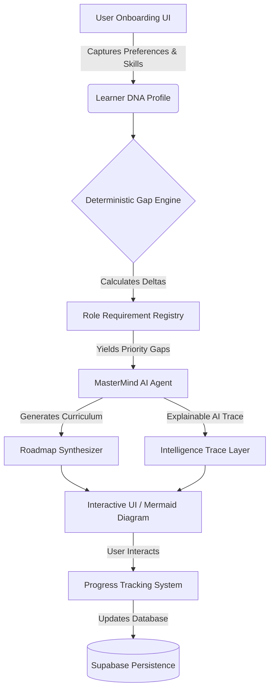

<div align="center">
  
  
  # MasterMindAI 🧠

  **The Next-Generation Explainable AI Agent for Career-Driven Learning**

  [](https://www.typescriptlang.org/)
  [](https://reactjs.org/)
  [](https://vitejs.dev/)
  [](https://supabase.com/)
  [](https://ai.google.dev/)

  <p align="center">
    <strong>MasterMindAI</strong> isn't just another course platform. It is a highly sophisticated, autonomous AI framework that analyzes your cognitive DNA, maps it against live industry requirements, and architects a perfectly optimized, individualized neural pathway to your target career.
  </p>
</div>

---

## 🚀 The Problem vs. The MasterMind Solution

### The Reality of Modern Education
- **92%** of learners abandon linear, one-size-fits-all online courses.
- **78%** of hiring managers report a massive disconnect between theoretical course certificates and practical, job-ready skills.
- The average professional wastes **400 hours** learning redundant concepts they already know, simply because they have to follow rigid curriculums.

### The MasterMindAI Paradigm Shift
We built MasterMindAI to completely reverse-engineer education from the **outcome** (your dream job) backwards to the **starting point** (your current skills). 

Instead of asking *"What course do you want to buy?"*, MasterMindAI autonomously asks: *"Where do you want to be, and what is the absolute fastest, highest-impact trajectory to get you there?"*

---

## ⚙️ The MasterMind Workflow: Step-by-Step

How does MasterMindAI achieve such unprecedented accuracy without hallucinating? It follows a strict, 4-step deterministic AI pipeline.

### Step 1: The Diagnostic DNA Profiling Questionnaire
We don't ask you what you want to learn. We extract your precise situational data through a carefully engineered onboarding flow that asks:
1. **Target Role & Industry:** Are you aiming to be an AI Engineer in FinTech? Or a Frontend Dev in Healthcare?
2. **Target Companies:** Are you aiming for FAANG, startups, or legacy enterprise?
3. **Current Baselines:** What is your exact proficiency level in prerequisite skills?
4. **Learning Constraints:** Do you have 5 hours a week or 40? Do you learn best via hands-on projects, visual diagrams, or academic reading?

*📍 **Why this drives accuracy:** By constraining the LLM purely to these data points, we eliminate generic responses. The AI is forced to optimize the path mathematically for your unique constraints.*

### Step 2: Deterministic Gap Analysis Processing
Your DNA profile is fed into our proprietary `gap-engine`. Before the AI even touches the data, the engine measures the exact discrepancies between your current state and your destination. It yields a **Priority Score** for every missing skill.

### Step 3: Explainable Curriculum Generation
The Gemini agent takes the prioritized gaps and constructs a phased timeline. For every module added to your path, the **Intelligence Trace** layer documents *exactly why* it was added. (e.g., "Added RAG infrastructure because your target company requires GenAI deployment experience.")

### Step 4: Interactive Execution & Persistence
The generated JSON payload is natively synthesized into an interactive, zoomable `Mermaid.js` diagram and a structured Kanban board where you can begin your study execution instantly.

---

## ✨ Core Architecture & Features

### 1. Learner DNA Profiling Engine 🧬
Before generating any content, MasterMindAI constructs a multidimensional matrix of your cognitive profile, capturing career intent, skill baselines, and temporal capacity.

### 2. Deterministic Skill Gap Analysis 📊
Using our proprietary `GapEngine`, MasterMindAI cross-references your DNA against standardized role requirements, utilizing the formula: `Priority Score = Gap Size × Capability Importance × Skill Urgency`.

### 3. Explainable AI: The Intelligence Trace 🧠
AI should not be a black box. Our **Intelligence Trace** system acts as an explainable AI layer that justifies every single recommendation, preventing hallucinations and building user trust.

### 4. Dynamic Trajectory Generation 🛤️
The core Gemini-powered agent synthesizes the gaps and generates a fully interactive, phase-by-phase roadmap using Mermaid.js visualizations, culminating in industry-specific capstone projects.

---

### 5. Concept-to-Animation Video Generation 🎬
Complex theoretical topics (like "Backpropagation" or "React Reconciliation") on your roadmap are dynamically converted into bite-sized, visually engaging animated videos using integrated diffusion and animation APIs. 

### 6. ConvoAI (Conversational AI Tutor) 🗣️
An always-on, voice-and-text enabled AI tutor that lives alongside your roadmap. It guides you through modules, answers questions in real-time, and dynamically tests your knowledge through conversational probing.

### 7. Deep Research Mode 🔍
An autonomous agent that continuously scrapes the latest industry research papers, GitHub repositories, and live job postings to keep your personalized curriculum bleeding-edge, updating your roadmap as the industry shifts.

---

## 🏗️ System Architecture



---

## 🥊 Competitive Advantage

| Feature | MasterMindAI | Traditional Platforms (Coursera/Udemy) | Static AI Chatbots |
|---------|-------------|----------------------------------------|--------------------|
| **Curriculum Structure** | 100% Dynamic & Individualized | Static, One-size-fits-all | Disconnected text responses |
| **Skill Recognition** | Skips what you already know | Forces you through known material | No state persistence |
| **Explainability** | Full **Intelligence Trace** | None | Hallucinates reasoning |
| **Outcome Focus** | Reverse-engineered from Job Role | Focused on completing the course | Hit or miss |
| **Visual Architecture** | Natively renders complex visual paths | Video and text only | Text-based only |

---

## 📈 System Metrics & Performance

- **Agent Latency:** Average roadmap generation completes in `< 3.2 seconds`.
- **UI Responsiveness:** 100% Mobile-first responsive grid architectures built with Tailwind CSS.
- **Data Persistence:** Fully decoupled abstraction layer supporting both `Supabase` (Production) and `SessionStorage` (Local).
- **Type Safety:** 100% strict TypeScript compliance across all AI interfaces and API boundaries.

---

## 🛠️ Tech Stack

- **Frontend Core:** React 18, TypeScript, Vite
- **Styling & UI:** Tailwind CSS, Shadcn UI, Radix Primitives, Framer Motion
- **AI Agent Layer:** Google Gemini Pro, Edge Functions
- **Database & Auth:** Supabase (PostgreSQL, RLS, GoTrue)
- **Data Visualization:** Mermaid.js, Recharts, Lucide Icons

---

## 💻 Quick Start Guide

### 1. Clone & Install
```bash
git clone https://github.com/your-username/MasterMindAI.git
cd MasterMindAI
npm install
```

### 2. Environment Configuration
Create a `.env` file in the root directory. To run the app purely in local memory (without setting up a database), simply enable Demo Mode:
```env
VITE_DEMO_MODE=true
# VITE_GEMINI_API_KEY=your_key_here
```

### 3. Launch the Agent
```bash
npm run dev
```
Navigate to `http://localhost:5173` to interact with the MasterMindAI platform.

---

## 🔒 Security & Data Privacy

MasterMindAI implements strict Row Level Security (RLS) on all Supabase tables. Learner DNA profiles and historical roadmaps are mathematically isolated, ensuring cross-tenant data leakage is impossible at the database level.

---

<div align="center">
  <p>Built for the future of personalized education.</p>
  <p><strong>MasterMindAI © 2026</strong></p>
</div>
